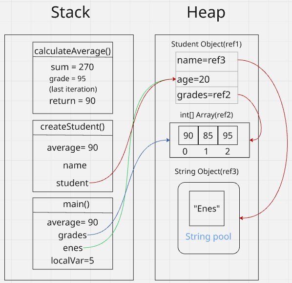

[](https://classroom.github.com/a/7TXVPuTD)

# 1.Object-Oriented Programming:

OOP is a programming paradigm that organizes software designs as objects. Each object has its own properties and methods. 

## Why Use Object-Oriented Programming?

OOP provides several advantages:

1. **Encapsulation**: Combines data and methods into a single unit to prevent unauthorized access (aka class)
2. **Inheritance**: Reusing code through parent-child relationships
3. **Polymorphism**: Allow objects of different types to be treated as objects of a common type.
4. **Abstraction**: Allow hiding implementation details while just expose only necessary functionality. In short focus on what an object does rather than how it does.


## Java vs C: Key Differences with Examples

### 1. Data Encapsulation and Access Control

**Java** provides access modifiers (private, protected, public) , while **C** lacks built-in data protection mechanisms.

<table>
<tr>
<th>Java (OOP)</th>
<th>C (Procedural)</th>
</tr>
<tr>
<td>

```java
public class BankAccount {
    private double balance;
    
    public void deposit(double amount) {
        if (amount > 0) {
            balance += amount;
        }
    }
    
    public boolean withdraw(double amount) {
        if (amount > 0 && balance >= amount) {
            balance -= amount;
            return true;
        }
        return false;
    }
    
    public double getBalance() {
        return balance;
    }
}

// Usage
BankAccount account = new BankAccount();
account.deposit(100);
// account.balance = -1000; // Error! Cannot access private field
account.withdraw(50);
double currentBalance = account.getBalance();
```

</td>
<td>

```c
// Bank account structure
struct BankAccount {
    double balance;
};

void deposit(struct BankAccount* account, double amount) {
    if (amount > 0) {
        account->balance += amount;
    }
}

int withdraw(struct BankAccount* account, double amount) {
    if (amount > 0 && account->balance >= amount) {
        account->balance -= amount;
        return 1;
    }
    return 0;
}

double getBalance(struct BankAccount* account) {
    return account->balance;
}

// Usage
struct BankAccount account = {0};
deposit(&account, 100);
account.balance = -1000; // Direct access is possible - no protection!
withdraw(&account, 50);
double bal = getBalance(&account);
```

</td>
</tr>
</table>

### 2. Inheritance

**Java** supports inheritance through the `extends` keyword, allowing classes to inherit properties and methods. **C** requires manual implementation of inheritance-like behavior.

<table>
<tr>
<th>Java (OOP)</th>
<th>C (Procedural)</th>
</tr>
<tr>
<td>

```java
public class Vehicle {
    protected double speed;
    protected String brand;
    
    public Vehicle(String brand) {
        this.brand = brand;
        this.speed = 0;
    }
    
    public void accelerate(double amount) {
        speed += amount;
    }
    
    public void brake(double amount) {
        speed = Math.max(0, speed - amount);
    }
    
    public double getSpeed() {
        return speed;
    }
    
    public String getBrand() {
        return brand;
    }
}

public class Car extends Vehicle {
    private int doors;
    private boolean convertible;
    
    public Car(String brand, int doors, boolean convertible) {
        super(brand);
        this.doors = doors;
        this.convertible = convertible;
    }
    
    public void honk() {
        System.out.println(getBrand() + " car honks!");
    }
    
    public int getDoors() {
        return doors;
    }
    
    public boolean isConvertible() {
        return convertible;
    }
}

// Usage
Car myCar = new Car("Toyota", 4, false);
myCar.accelerate(30);    // Inherited method
myCar.brake(10);         // Inherited method
myCar.honk();            // Car-specific method
System.out.println("Speed: " + myCar.getSpeed());
System.out.println("Brand: " + myCar.getBrand());
System.out.println("Doors: " + myCar.getDoors());
```

</td>
<td>

```c
// Base structure
struct Vehicle {
    double speed;
    char brand[50];
};

void initVehicle(struct Vehicle* vehicle, const char* brand) {
    strcpy(vehicle->brand, brand);
    vehicle->speed = 0;
}

void accelerate(struct Vehicle* vehicle, double amount) {
    vehicle->speed += amount;
}

void brake(struct Vehicle* vehicle, double amount) {
    vehicle->speed = (vehicle->speed > amount) ? 
                    vehicle->speed - amount : 0;
}

double getSpeed(struct Vehicle* vehicle) {
    return vehicle->speed;
}

const char* getBrand(struct Vehicle* vehicle) {
    return vehicle->brand;
}

// Derived structure
struct Car {
    struct Vehicle base;  // Composition to simulate inheritance
    int doors;
    int convertible;      // 0 = false, 1 = true
};

// Car-specific functions
void initCar(struct Car* car, const char* brand, 
             int doors, int convertible) {
    initVehicle(&car->base, brand);
    car->doors = doors;
    car->convertible = convertible;
}

void honk(struct Car* car) {
    printf("%s car honks!\n", car->base.brand);
}

int getDoors(struct Car* car) {
    return car->doors;
}

int isConvertible(struct Car* car) {
    return car->convertible;
}

// Usage
struct Car myCar;
initCar(&myCar, "Toyota", 4, 0);
accelerate(&myCar.base, 30);  // Must access base explicitly
brake(&myCar.base, 10);       // Must access base explicitly
honk(&myCar);
printf("Speed: %f\n", getSpeed(&myCar.base));
printf("Brand: %s\n", getBrand(&myCar.base));
printf("Doors: %d\n", getDoors(&myCar));
```

</td>
</tr>
</table>

### 3. Polymorphism

**Java** supports polymorphism. **C** requires manual function pointer management.

<table>
<tr>
<th>Java (OOP)</th>
<th>C (Procedural)</th>
</tr>
<tr>
<td>

```java
public interface Shape {
    double getArea();
    double getPerimeter();
    void display();
}

public class Circle implements Shape {
    private double radius;
    
    public Circle(double radius) {
        this.radius = radius;
    }
    
    @Override
    public double getArea() {
        return Math.PI * radius * radius;
    }
    
    @Override
    public double getPerimeter() {
        return 2 * Math.PI * radius;
    }
    
    @Override
    public void display() {
        System.out.println("Circle with radius: " + radius);
    }
}

public class Rectangle implements Shape {
    private double width, height;
    
    public Rectangle(double width, double height) {
        this.width = width;
        this.height = height;
    }
    
    @Override
    public double getArea() {
        return width * height;
    }
    
    @Override
    public double getPerimeter() {
        return 2 * (width + height);
    }
    
    @Override
    public void display() {
        System.out.println("Rectangle with width: " + width + 
                          " and height: " + height);
    }
}

// Usage
Shape[] shapes = {new Circle(5), new Rectangle(4, 6)};
for (Shape shape : shapes) {
    shape.display();
    System.out.println("Area: " + shape.getArea());
    System.out.println("Perimeter: " + shape.getPerimeter());
    System.out.println("---------------------------");
}
```

</td>
<td>

```c
// Function pointer types
typedef double (*AreaCalculator)(void*);
typedef double (*PerimeterCalculator)(void*);
typedef void (*DisplayFunction)(void*);

// Base structure
struct Shape {
    AreaCalculator getArea;
    PerimeterCalculator getPerimeter;
    DisplayFunction display;
    void* data;
};

// Concrete shapes
struct Circle {
    double radius;
};

struct Rectangle {
    double width;
    double height;
};

// Circle functions
double circle_getArea(void* data) {
    struct Circle* circle = (struct Circle*)data;
    return 3.14159 * circle->radius * circle->radius;
}

double circle_getPerimeter(void* data) {
    struct Circle* circle = (struct Circle*)data;
    return 2 * 3.14159 * circle->radius;
}

void circle_display(void* data) {
    struct Circle* circle = (struct Circle*)data;
    printf("Circle with radius: %f\n", circle->radius);
}

// Rectangle functions
double rectangle_getArea(void* data) {
    struct Rectangle* rect = (struct Rectangle*)data;
    return rect->width * rect->height;
}

double rectangle_getPerimeter(void* data) {
    struct Rectangle* rect = (struct Rectangle*)data;
    return 2 * (rect->width + rect->height);
}

void rectangle_display(void* data) {
    struct Rectangle* rect = (struct Rectangle*)data;
    printf("Rectangle with width: %f and height: %f\n", 
           rect->width, rect->height);
}

// Usage
struct Circle c = {5};
struct Rectangle r = {4, 6};

struct Shape shapes[] = {
    {circle_getArea, circle_getPerimeter, circle_display, &c},
    {rectangle_getArea, rectangle_getPerimeter, rectangle_display, &r}
};

for (int i = 0; i < 2; i++) {
    shapes[i].display(shapes[i].data);
    printf("Area: %f\n", shapes[i].getArea(shapes[i].data));
    printf("Perimeter: %f\n", shapes[i].getPerimeter(shapes[i].data));
    printf("---------------------------\n");
}
```

</td>
</tr>
</table>

### 4. Abstraction

**Java** provides abstract classes and methods. **C** lacks built-in abstraction mechanisms.

<table>
<tr>
<th>Java (OOP)</th>
<th>C (Procedural)</th>
</tr>
<tr>
<td>

```java
public abstract class Animal {
    protected String name;
    protected int age;
    
    public Animal(String name, int age) {
        this.name = name;
        this.age = age;
    }
    
    public abstract void makeSound(); // Must be implemented
    
    public void sleep() {
        System.out.println(name + " is sleeping");
    }
    
    public void eat(String food) {
        System.out.println(name + " is eating " + food);
    }
    
    public String getName() {
        return name;
    }
    
    public int getAge() {
        return age;
    }
}

public class Dog extends Animal {
    private String breed;
    
    public Dog(String name, int age, String breed) {
        super(name, age);
        this.breed = breed;
    }
    
    @Override
    public void makeSound() {
        System.out.println(name + " barks: Woof woof!");
    }
    
    public void fetch() {
        System.out.println(name + " is fetching the ball");
    }
    
    public String getBreed() {
        return breed;
    }
}

// Usage
Animal animal = new Dog("Rex", 3, "German Shepherd");
animal.makeSound();  // Calls overridden method
animal.sleep();      // Calls method from abstract class
// animal.fetch();   // Error! Not accessible through Animal reference
System.out.println("Name: " + animal.getName());
```

</td>
<td>

```c
// Function pointer types
typedef void (*MakeSoundFunc)(void*);
typedef void (*SleepFunc)(void*);
typedef void (*EatFunc)(void*, const char*);

// Abstract "base class" structure
struct Animal {
    char name[50];
    int age;
    MakeSoundFunc makeSound;  // Virtual function
    SleepFunc sleep;          // Common implementation
    EatFunc eat;              // Common implementation
    void* derived;            // Pointer to derived data
};

// Common functions for all animals
void animal_sleep(void* data) {
    struct Animal* animal = (struct Animal*)data;
    printf("%s is sleeping\n", animal->name);
}

void animal_eat(void* data, const char* food) {
    struct Animal* animal = (struct Animal*)data;
    printf("%s is eating %s\n", animal->name, food);
}

// Dog-specific structure
struct Dog {
    struct Animal base;  // "Inherits" from Animal
    char breed[50];
};

// Dog-specific functions
void dog_makeSound(void* data) {
    struct Dog* dog = (struct Dog*)data;
    printf("%s barks: Woof woof!\n", dog->base.name);
}

void dog_fetch(struct Dog* dog) {
    printf("%s is fetching the ball\n", dog->base.name);
}

// Constructor-like function for Dog
void createDog(struct Dog* dog, const char* name, 
               int age, const char* breed) {
    strcpy(dog->base.name, name);
    dog->base.age = age;
    strcpy(dog->breed, breed);
    
    // Set up function pointers
    dog->base.makeSound = dog_makeSound;
    dog->base.sleep = animal_sleep;
    dog->base.eat = animal_eat;
    dog->base.derived = dog;  // Point to self for callbacks
}

// Utility function to get base Animal pointer from Dog
struct Animal* getDogAsAnimal(struct Dog* dog) {
    return &dog->base;
}

// Usage
struct Dog rex;
createDog(&rex, "Rex", 3, "German Shepherd");

struct Animal* animal = getDogAsAnimal(&rex);
animal->makeSound(animal->derived);  // Calls dog implementation
animal->sleep(animal);               // Calls common implementation
// dog_fetch(animal);                // Would need casting
printf("Name: %s\n", animal->name);
```

</td>
</tr>
</table>

# 2.Interface vs Abstract class

Both of them are used to achieve abstraction.
But there are some differences:

- **Interface**: Defines contract that classes must implement but doesn't provide implementation but after Java 8 it can have default and static methods.
- **Abstract Class**: It is like a normal class but it can have both implementation and abstract methods. Main purpose is to provide common functionality that can be extended by subclasses.

Key differences:
- **Interface** supports multiple inheritance while **Abstract class** doesn't.
- **Abstract class** can have constructor while **Interface** doesn't.
- **Abstract class** can have instance variables with any access modifiers while **Interface** just has constants (public static final).

Abstract classes represent an "is-a" relationship while interfaces represent a "can-do" relationship.
For instance:

``` java
// Interface
interface Drawable {  // A concere class that implemented this interface can draw something
    void draw();
}

// Abstract class
abstract class Shape { // A concrete class that extend this abstract class is a shape
    abstract void draw();
}
```

# 3. hashCode() and equals():
<table>
<tr>

<td width="50%">

```java
//equals() and hashCode() not overriden
HashSet<User> list = new HashSet<>();
User user = new User(1L, "test", "test", "ROLE_USER");
User user2 = new User(1L, "test", "test", "ROLE_USER");
System.out.println(user.equals(user2)); //false
list.add(user);
list.add(user2);
hashCode(user); // 167304929
hashCode(user2); // 167304939
System.out.println(list.size()); // 2
```
</td>
<td width="50%">

</td>


</table>

When equals() is not overriden, it inherit from Object and it check memory addresses so user.equals(user2) is not equal and if user want to keep unique object in HashSet or HashMap, the process uses hashCode() to check objects are unique or not. So equal objects must have same hashCode() value.Therefore, if equals() is overriden for an object then hashCode() must be overriden too.


# 4. Diamon problem in Java ? How to fix it?​


Diamond problem is an issue when a class inherits from two classes(or interface) that share the same superclass. 
Java does not support multiple inheritance but still it can occur in interface.

How to fix it?

``` java

interface A {
    default void hello() {
        System.out.println("Hello from A");
    }
}

interface B extends A {
    default void hello() {
        System.out.println("Hello from B");
    }
}

interface C extends A {
    default void hello() {
        System.out.println("Hello from C");
    }
}
class D implements B, C {
    @Override
    public void hello() {
        //problem can be fixed by calling the method from the specific interface
        B.super.hello(); // or C.super.foo();
    }
    public static void main(String[] args) {
        D d = new D();
        d.hello(); // This will call the hello method from interface B
    }}

```


# 5.Garbace Collector

In programming languages, memory management handled by different methods like garbage collector. Some langauges leave memory management to programmer while some other languages have built-in garbage collector.

``` c
int* num = (int*)malloc(sizeof(int)); 
    *num = 42;

      free(num); // in C language we need to free memory manually

```

Gargabe collector is a program that helps to:
- Detect unused memory
- Free unused memory
- Improve safety(prevent manuel errors)

Garbage collector has 3 stages:
- Marking: Mark all objects that are still in use (in heap)
- Sweeping: Free all objects that are not marked
- Compacting: Move all objects to the beginning of the heap

But there is a problem with this method. If we have a lot of objects in heap, it will take a lot of time to mark and sweep. So we need to find a way to improve this method.
In this case generational garbage collector comes to play.
This method divides heap into 2 parts:
-Young generation: Objects that are created recently (this is the place GC run frequently)
-Old generation: Objects that are created long time ago (this is the place GC run less frequently)


# 6.Java ‘static’ keyword

The static keyword in java used to define class level variables rather than class' instances.
So it is mean it does not matter how many times we create an object of that class, there will be only one copy of that static variable and the value of static field is shared across all objects.

``` java
public class Example {
    static int classVar = 0;

    static void staticMethod() {
        Example.classVar++;
        System.out.println("ClassVar: " + classVar);
    }
    static void staticMethod2() {
        classVar++;
        System.out.println("ClassVar: " + classVar);
    }

    public static void main(String[] args) {
        Example.staticMethod(); // Call without creating an object
        Example.staticMethod2();
        //Output: ClassVar: 1
        //Output: ClassVar: 2
    }
}
```
We called staticMethod() and staticMethod2() without creating an object of Example class and increment classVar variable in both methods.


# 7.Immutability

Immutability means when object has been created, it can not be changed during its ife cycle. Any operation that changes the state of an object creates a new object.

For example:

<table>
<tr>
<td width="30%">

```java
String name="Enes"
name += " Aslan"
```
</td>
<td width="70%">


</td>
</tr>
</table>

As you see on image when add "Aslan" to name, it creates a new String in heap and adress of name variable is changed to new String.
But the old string is waiting string pool until it's no longer referenced by any variable and become suitable for garbage collection.
This is why string concentation in loops is not efficent.

## Where, How and Why to use immutability?

### Use immutability when you want to share object between multiple threads.

``` java

public final class Distance {
    private final double meters; // Final field (immutable)

    public Distance(double meters) {
        this.meters = meters;
    }
    public Distance add(Distance other) {
        return new Distance(this.meters + other.meters);
    }
 
    public Distance toKilometers() {
        return new Distance(this.meters / 1000);
    }
  
    public double getMeters() {
        return meters;
    }
}

```

Imagine that sensor app where multiple threads read distances frequently. If distance were mutable concurrent access could cause data inconsistency. Thats why we should keep every measure of distance immutable to prevent inconsistency in calculation

``` java

Distance d1 = new Distance(100); // 100 meters
Distance d2 = new Distance(200); // 200 meters
Distance total = d1.add(d2); // New object: 300 meters

```

### Hashcode stability

Immutable objects make easier to use as keys in hash tables.
For instance:

```java
Map<String, Integer> scores = new HashMap<>();
String key = "Alice";
scores.put(key, 100);

key = "Bob";

System.out.println(scores.get("Alice")); // Output: 100
```
So even if you change the key, it still return the value of the old key.

### As a value, configuration object or domain model

```java
private static final String PHONE_REGEX = "^\\+(?:[0-9]●?){6,14}[0-9]$";

public static final double PI = 3.141592653589793; //Built-in constans from java.lang.Math class

public static String getDatabaseUrl() {
        return config.getProperty("db.url");
    }

public static final String REGISTER = "/register";

```

# 8.Composition and Aggregation

They are both important concepts in object-oriented programming that represent relationships between clasess.
Helps us to model real world relationships.

## Composition

Composition implies strong relationship between classes where the child class cant exist without the parent class. Simply say "You are nothing without me".


## Aggregation

Aggregation is a weaker form of has-a relationships. Both entries have independent lifecyle and they can exist without each other.


As you seen on UML a single student can associate with multiple Instructor. If a student is deleted, the instructors still exist or vice versa.


# 9. Cohesion and Coupling

## Cohesion 

Cohesion is a degree to which a class or module is self-contained and related to a single purpose.


There are two types of cohesion:

### High Cohesion

High cohesion means that elements are tightly related and work together to achieve a single purpose.

```java
class AuthService {
    public boolean login(String username, String password) { ... }
    public void logout() { ... }
    public boolean resetPassword(String email) { ... }
}
```
In AuthService classes every method related to authentication.So it can be considered as high cohesion.

### Low cohesion

Low means that elements are not related to a single purpose.

```java

class Utility {
    public void sendEmail() { ... }
    public void parseJson() { ... }
    public void calculateTax() { ... }
}
```

"High cohesion is when you have a class that does a well defined job. Low cohesion is when a class does a lot of jobs that don't have much in common."

## Coupling 

Coupling is a degree of independency between classes or modules.

### Tight coupling
High coupling means that classes are highly dependent on each other.

``` java

class UserService {
    private MySQLDatabase db = new MySQLDatabase();
    
    void saveUser(User user) {
        db.save(user); // Works only with MySQL
    }
}

```
### Loose coupling
 Loose coupling means that classes are less dependent on each other.

```java
interface Database {
    void save(User user);
}

class MySQLDatabase implements Database {
    public void save(User user) { ... }
}

class MongoDB implements Database {
    public void save(User user) { ... }
}

class UserService {
    private Database db;
    
    UserService(Database db) {
        this.db = db;
    }
    
    void saveUser(User user) {
        db.save(user); // Works with any Database
    }
}

```

# 10.Heap and Stack means and differences ?​


Before we dive into stack and heap, let me explain what is a memory. When your programs run it needs to space to store data. JVM organizes this memory into different regions, with the stack and heaps being the most important and both stack and heap memory are located in computer's RAM

## Stack

The stack is a data structure that stores information in the form of a Last-In-First-Out (LIFO) list. It is used to store local variables and method calls.

## Heap

It is also known as dynamic memory. It is used to store objects and data. Its great for storing large data structures or objects.


### How it works ?

<table>
<tr>
<td>


```java

public class MemoryDemo {
    public static void main(String[] args) {
        // Stack: main method frame is created
        
        int localVar = 5;          // Stack: localVar is created
        
        Student enes = createStudent("Enes", 20);  // Stack: enes reference
        
        int[] grades = new int[3]; // Stack: grades reference
                                    // Heap: int array object
        
        grades[0] = 90;            // Heap: array element modified
        grades[1] = 85;            // Heap: array element modified
        grades[2] = 95;            // Heap: array element modified
        
        alice.setGrades(grades);   // Heap: Student object updated
        
        double average = enes.calculateAverage();  // Stack: average variable
        
        System.out.println(average);  // Prints 90.0
    }
    
    public static Student createStudent(String name, int age) {
        // Stack: createStudent method frame with parameters name and age
        
        Student student = new Student(name, age);  // Stack: student reference
                                                   // Heap: Student object
        
        return student;  // Returns reference to the Student object
    }
}

class Student {
    private String name;    // These instance variables will be stored in the heap
    private int age;        // as part of the Student object
    private int[] grades;
    
    public Student(String name, int age) {
        this.name = name;
        this.age = age;
    }
    
    public void setGrades(int[] grades) {
        this.grades = grades;  // Stores the reference to the grades array
    }
    
    public double calculateAverage() {
        // Stack: calculateAverage method frame
        
        int sum = 0;           // Stack: sum variable
        
        for(int grade : grades) {  // Stack: grade variable for each iteration
            sum += grade;
        }
        
        return (double) sum / grades.length;  // Calculation happens on stack
    }
}


```
</td>
<td width="50%">



</td>
</tr>
</table>

### Differences between stack and heap
# Stack vs Heap Memory Differences

| **Feature**                  | **Stack**                                                                 | **Heap**                                                                 |
|------------------------------|---------------------------------------------------------------------------|---------------------------------------------------------------------------|
| **Memory Management**        | Automatic (managed by the compiler).                                     | Manual (managed by the programmer or garbage collector).                 |
| **Speed**                    | Fast (uses pointer adjustment).                                          | Slow (requires searching for memory blocks and handling fragmentation).  |
| **Memory Size**              | Fixed size (determined at program start).                                | Dynamic size (can grow/shrink during runtime).                           |
| **Data Accessibility**       | Accessible only during active function calls.                            | Accessible until explicitly deallocated or the program ends.             |
| **Purpose**                  | Function calls, local variables, control data (e.g., return addresses).  | Dynamically allocated objects (e.g., created with `new` in Java/C++).    |
| **Allocation**               | Contiguous (LIFO structure).                                             | Random (hierarchical structure).                                         |
| **Thread Safety**            | Thread-safe (only accessible by the owning thread).                      | Not thread-safe (accessible by all threads).                             |
| **Flexibility**              | Fixed size (no resizing).                                                | Supports dynamic resizing.                                               |
| **Cost**                     | Low (direct stack operations).                                           | High (fragmentation and search overhead).                                |
| **Data Structure**           | Linear (sequential function calls).                                      | Hierarchical (objects at scattered addresses).                           |
| **Common Issues**            | Stack overflow (e.g., infinite recursion).                               | Memory leaks or fragmentation.                                           |
| **Preferred Use Cases**      | Static data (e.g., arrays, primitive types).                             | Dynamic data (e.g., linked lists, large objects).                        |
| **Locality of Reference**    | Excellent (sequential access).                                           | Adequate (random access).                                                |
| **Implementation Complexity**| Simple (compiler-managed).                                               | Complex (manual management or GC optimization required).                 |

---

## Examples
### **Stored in Stack**:
- Primitive types (`int x = 10`).
- Function parameters (`methodA(int param)`).
- Local variables (`double y = 20.5`).

### **Stored in Heap**:
- Objects (`Person person = new Person("Enes")`).
- String literals (`String message = "Hello"`).
- Dynamic data structures (e.g., `ArrayList`, `HashMap`).

---

## Summary
- **Stack**: Fast, automatic, function-scoped, short-lived data.
- **Heap**: Slow, dynamic, globally accessible, long-lived data.

# 11.Exceptions

An exception is an event that occurs during the execution of a program and distrupt the normal flow of the program.
In java Exceptions(as a class) are subclass of Throwable class.

Flow of exception
When something goes wrong in Java, a special object called Exception object is created. We can think of this a detailed inciden report and its containing:
- Type of problem
- Where it happened
- The state of the program


The method where the problem occured "throws" this exception object and handing to JVM. In short it says "hey, I have a problem and I don't know how to handle it".

Once an exception is thrown, runtime system searches backwards throught call stack(it is the list of active method calls) to find handlers(try-catch) block that matches the error type if finds it, it passes the exception object to the handler. If it doesn't find it, JVM will terminate the program.


``` java

public static void methodA() {
        try {
            methodB();
        } catch (NullPointerException e) {
            System.out.println("Exception caught in methodA(): " + e.getMessage());
        }
    }

    public static void methodB() {
        methodC();
    }

    public static void methodC() {
        throw new NullPointerException("Null pointer exception!");
    }

    public static void main(String[] args) {
      methodA();
    }

```


When an error occurs in methodC, the runtime system first searches for an exception handler in methodC. If it doesn't find one, it searches in methodB. If it still doesn't find a handler, it searches in methodA. If no exception handler is found in any of these methods, the JVM terminates the program but in this example we have a handler in methodA so the program continues to run.


There are three type of exceptions:

### Checked Exceptions:
Checked exceptions are exceptions that are checked at compile time. It is mean you have to handle them before run the program.(It will throw exception if you try to run the program)

The use of checked exceptions is a debated topic in software development. Some developers, including In an interview with Bruce Eckel, Anders Hejlsberg (creator and key architect of C# and .NET) argued against checked exceptions, stating that they are problematic because programmers often catch them without proper handling, which leads to hiding actual problems and some developer complaining about that specify every possible exceptions make process overwhelming. However, Oracle's documentation states: 'Make it a checked exception if you expect the client can reasonably recover from it. Make it an unchecked exception if the client cannot do anything to recover from it.'

### You can check the links for furher reading:
- [Stackoverflow discussion: The case against checked exceptions](https://stackoverflow.com/questions/613954/the-case-against-checked-exceptions)
- [The interview with Anders Hejlsberg: The Trouble with Checked Exceptions](https://www.artima.com/articles/the-trouble-with-checked-exceptions)
- [Oracle Documentation: Unchecked Exceptions](https://docs.oracle.com/javase/tutorial/essential/exceptions/runtime.html)

```java
public class FileReaderExample {
    // This method will not compile because FileNotFoundException is not handled
    public static void readFileWithoutHandling() {
        FileReader fileReader = new FileReader("test.json"); // This line causes compilation error
    }

    // Method 1: Handling with try-catch block
    public static void readFileWithTryCatch() {
        try {
            FileReader fileReader = new FileReader("test.json");
            // Use the fileReader here
        } catch (java.io.FileNotFoundException e) {
            System.out.println("File not found: " + e.getMessage());
        }
    }

    // Method 2: Declaring throws in method signature
    public static void readFileWithThrows() throws java.io.FileNotFoundException {
        FileReader fileReader = new FileReader("test.json");
        // Use the fileReader here
    }

    public static void main(String[] args) {
        // This will work fine
        readFileWithTryCatch();

        // This requires try-catch because it calls a method that throws
        try {
            readFileWithThrows();
        } catch (java.io.FileNotFoundException e) {
            System.out.println("File not found in main: " + e.getMessage());
        }
        // Uncommenting the line below will cause compilation error
        // readFileWithoutHandling();
    }
}
```


### Unchecked Exception

Unchecked exceptions are exceptions that the Java compiler does not require you to handle and mostly cause by programmers mistake such as try to reach an element that doesn't exist in an array. Furthermore we dont have to declare unchecked expeptions with throws keyword

```java

public class Example {
    public static void main(String[] args) {
        int[] numbers = {1, 2, 3};
        System.out.println(numbers[3]); // ArrayIndexOutOfBoundsException
    }
}

```


When to use checked exceptions and unchecked exceptions?

As we mentioned on checked exception about oracle documentation :

**"Make it a checked exception if you expect the client can reasonably recover from it. Make it an unchecked exception if the client cannot do anything to recover from it.""**


# 12.Clean code is:
## a code that easy to read, understand, and maintain.


# 13. What is method hiding in Java?

Method hiding is a concept in Java allows to defines subclass' static method with the same signature as a method in the superclass.
It rarely used and not considered a good practice. 
Link : [Stackoverflow discussion](https://stackoverflow.com/questions/2223386/why-doesnt-java-allow-overriding-of-static-methods)   and [Further reading about statics but related](https://stackoverflow.com/questions/7026507/why-are-static-variables-considered-evil/7084473#7084473)


# 14.What is the difference between abstraction and polymorphism in Java ?​

These are two fundemental concepts in OOP.

## 1-Abstraction
 As we talked before is a process of hiding the implementation details and showing only the functionality to the user. We can implement through abstract class and interface. Link -> [Interface vs Abstract class](#2interface-vs-abstract-class)

 ## 2-Polymorphism
 Polymorphism is a concept in OOP that allows you to perform a single action in different ways. We can implement through method overloading and method overriding.


